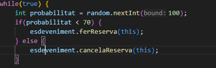
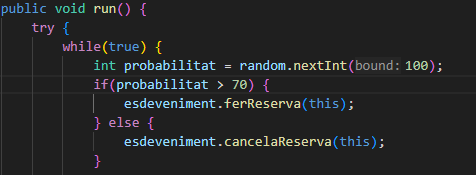

1. Per què s'atura l'execució al cap d'un temps?
perque tots els assistents queden aturats en wait()

2. Què passaria si en lloc de una probabilitat de 50%-50% fora de 70%(ferReserva)-30% (cancel·lar)? I si foren al revés les probabilitats? Mostra la porció de codi modificada i la sortida resultant en cada un dels 2 casos

caso 1 
es bloqueria més rapid

caso 2
es bloqueria més lent 

3. Perquè creus que fa falta la llista i no valdria només amb una variable sencera de reserves?

No sabriem a quí cancel·lar reserva, i un assistent que no te plaça podria cancel·lar li a un altre. 